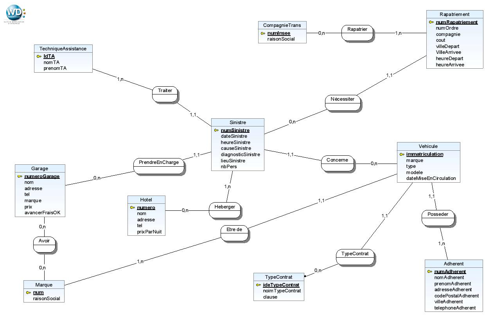
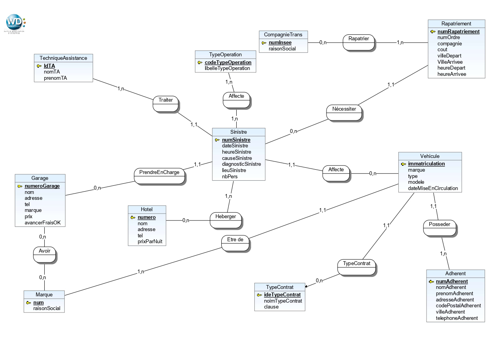
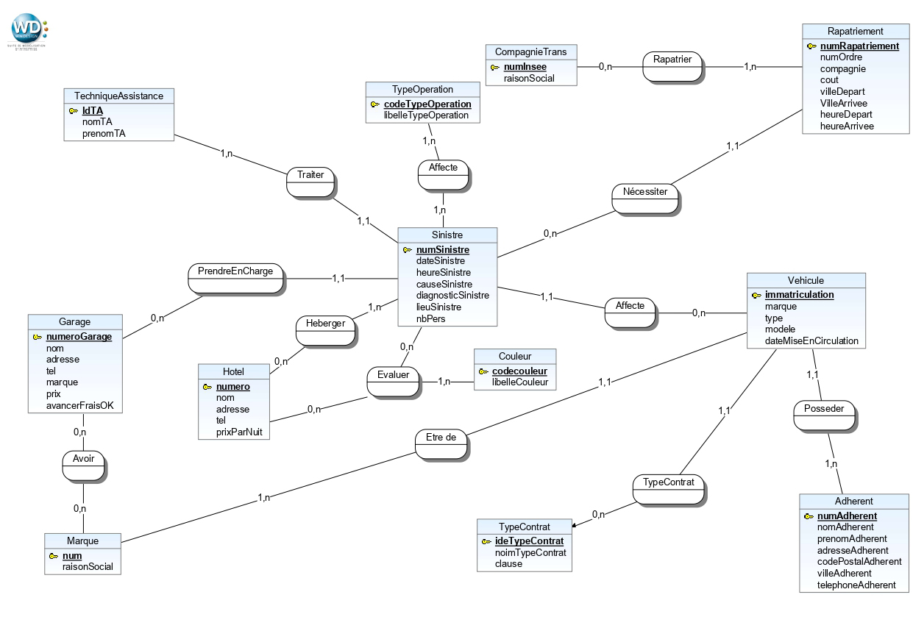

<h1 style="text-align:center; color:#21458F ; font-weight:bold;">SLAM3 - TD Asssitour</h1>

**Lien repos distant** : `https://github.com/BethuneClemence/SLAM3-TD-ASSISTOUR`

<h2 style="font-weight:bold; color:#0041D1";>1 - Implémentation de la base de données</h2>

>***Créer la base de données PostgreSQL nommée assistour***

```sql
CREATE DATABASE IF NOT EXISTS ASSISTOUR;
\c ASSISTOUR;
```

>***Saisir le MEA sous WinDesign***



_Script de création de la base ->_ `creerAssistour.sql`

>***Créer les tables de la base de donnée assistour***

```sql
-- Cette commande fontionne si nous sommes positionné dans le même dossier que le fichier à exécuter ...
\i creerAssistour.sql
```
>***Ecrire le script peuplerAssistour.sql***

_Script pour peupler la base ->_ `peuplerAssistour.sql`

>***Ecrire les requetes d'interrogation suivantes (interrogerAssistour.sql)***


```sql
-- Liste des hotels qui ont hébergé M.IVANOVICH (sinistre du 20/05/2020)
SELECT h.*
FROM hotel as h INNER JOIN heberger as hb
ON h.numero = hb.numero
INNER JOIN sinistre as s
ON hb.numsinistre = s.numsinistre
INNER JOIN vehicule as v
on v.immatriculation = s.immatriculation
inner join adherent as a
ON a.numadherent = v.numadherent
WHERE a.nomadherent = 'IVANOVICH'
AND s.datesinistre = '2020-05-20';

```


```sql
-- Nombre totalde nuitées à l'hotel dont a bénéficier M.IVANOVICH

SELECT sum(hb.nbNuitee)
FROM hotel as h INNER JOIN heberger as hb
ON h.numero = hb.numero
INNER JOIN sinistre as s
ON hb.numsinistre = s.numsinistre
INNER JOIN vehicule as v
on v.immatriculation = s.immatriculation
inner join adherent as a
on a.numadherent = v.numadherent
where a.nomadherent = 'IVANOVICH'
AND s.datesinistre = '2020-05-20';

```


```sql
-- Liste ordonnée des trajets du rapatriement du couple BELKACEM

select r.*, a.nomadherent
from rapatriement as r
inner join sinistre as s
on s.numsinistre = r.numsinistre
inner join vehicule as v
on s.immatriculation = v.immatriculation
inner join adherent as a 
on a.numadherent = v.numadherent
where a.nomadherent = 'BELKACEM';


```


<br>
<br>
<br>
<br>
<bR>
<br>
<bR>
<br>
<bR>
<br>
<bR>
<br>
<br>
<br>

```sql
-- Montant total dépensé pour le rapatriement du couple BELKACEM

select  sum(r.cout)
from rapatriement as r
inner join sinistre as s
on s.numsinistre = r.numsinistre
inner join vehicule as v
on s.immatriculation = v.immatriculation
inner join adherent as a 
on a.numadherent = v.numadherent
where a.nomadherent = 'BELKACEM'
and s.datesinistre = '2020-06-03';
```


<h2 style="font-weight:bold; color:#0041D1";>Suite du TD Asisstour</h2>

<h3 style="font-weight:bold; color:#363E4F" >Proposition de modélisation pour la règle de gestion RG201</h3>
<br>

>***Expliquer pourquoi la modélisation proposée s'appuie sur une fausse ternaire***

```txt
La modélisation proposée s'appuie sur une fausse ternaire car un dossierSinistre peut concerner plusieurs voitures en meme temps. Pour cela, il faut donc passer a une modélisation binaire.
```
<br>
<br>
<br>
<br>
<br>
<br>

>***Proposer une correction du Modèle Entité-Association***


<br>

>***Ecrire le Modèle Relationnel qui correspond au MEA de la question 2***


<b>TypeOperation</b> (<u>codeTypeOperation</u>, libelleTypeOperation)

<b>Affecte</b> (<u>#numSinistre, #codeTypeOperation</u>)

<b>Sinistre</b> (<u>numSinistre</u>, dateSinistre, heureSinistre, causeSinistre, diagnosticSinistre, lieuSinistre, nbPers, #immatriculation)

<b>Vehicule</b> (<u>immatriculation</u>, marque, type, modele, dateMiseEnCirculation)

<br>
<br>
<br>
<br>
<br>
<br>
<br>
<br>
<br>
<br>
<h3 style="font-weight:bold; color:#363E4F" >Proposition de modélisation pour la règle de gestion RG202</h3>

>***Expliquer pourquoi la modélisation proposée s'appuie sur une fausse ternaire***

```txt
La modélisation s'appuie sur une fausse ternaire car un hotel peut etre évaluer plusieurs fois pour le meme dossierSinistre.Il faut donc définir numDossier ainsi que numHotel en tant que clef primaire.
```

>***Proposer une correction du MEA***




>***Ecrire le Modèle Relationnel qui correspond au MEA***

<b>Hotel</b> (<u>numero</u>, nom, adresse, tel, prixParNuit)

<b>DossierSinistre</b> <u>numSinistre</u>, dateSinistre, heureSinistre, causeSinistre, diagnosticSinistre, lieuSinistre, nbPers, #immatriculation)

<b>Couleur</b> (<u>codeCouleur</u>, libelleCouleur)

<b>Evaluer</b> (<u>#dossierSinistre, #numHotel</u>, codeCouleur)

<br>
<br>

<h2 style="font-weight:bold; color:#0041D1"; >Implémentation</h2>

>***Insérer le tuple suivant evaluer (hotel ocean, jaune)***

```sql
INSERT INTO EVALUER VALUES('2', '1', '2');
```


```sql
--Cette requete permet d'obtenir pour chaque hotel, la signification de la couleur qu'il a obtenu

select h.nom, c.signification from
hotel as h inner join evaluer as e
on h.numero = e.numero
inner join couleur as c 
on c.codecouleur = e.codecouleur
inner join sinistre as s
on s.numsinistre = e.numsinistre;

```
